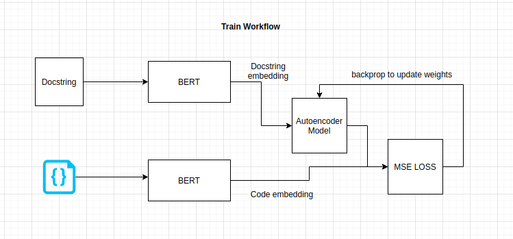
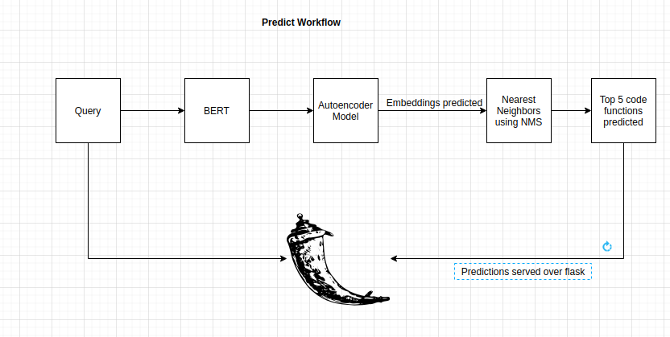
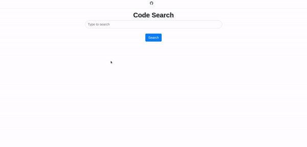

# Code Search Net
**Table of Contents**

<!-- TOC depthFrom:1 depthTo:6 withLinks:1 updateOnSave:1 orderedList:0 -->

- [Quickstart](#quickstart)
- [Introduction](#introduction)
	- [Project Overview](#project-overview)
	- [Data](#data)
- [Data Details](#data-details)
	- [Schema & Format](#schema--format)
- [Training Workflow](#training-workflow)
- [Predict Workflow](#predict-workflow)
- [Demo Video](#demo-gif)
- [References](#references)

<!-- /TOC -->

# Quickstart

  ```bash
  # clone this repository
  git clone https://github.com/Iron-Stark/code-search-net
  cd code-search-net/
  mkdir resources/
  # download data (~3.5GB) from S3;
  #The s3 links follow this pattern:
  # https://s3.amazonaws.com/code-search-net/CodeSearchNet/v2/{python,java,go,php,ruby,javascript}.zip
  # For example, the link for the python is:
  # https://s3.amazonaws.com/code-search-net/CodeSearchNet/v2/python.zip
  wget https://s3.amazonaws.com/code-search-net/CodeSearchNet/v2/python.zip
  unzip python.zip
  rm python.zip
  
  mkdir generated_resources
  sh install_dependencies.sh
  python preprocess_data.py

  python train.py

  ```
After training is complete, launch the flask app by running flask/app.py and then goto localhost:5000 to access the engine.


# Introduction

This project aims at building a search engine which takes as input a search query and finds a function from the large pool of source code available which implements the functionality semantically matching the query.

## Project Overview
Semantic code search is the task of retrieving relevant code given a  natural language query. While related to other information retrieval tasks, it requires bridging the gap between the language used in  code (often abbreviated and highly technical) and natural language  more suitable to describe vague concepts and ideas.

## Data
The primary dataset consists of 2 million (`comment`, `code`) pairs from open source libraries.  Concretely, a `comment` is a top-level function or method comment (e.g. [docstrings](https://en.wikipedia.org/wiki/Docstring) in Python), and `code` is an entire function or method. Currently, the dataset contains Python, Javascript, Ruby, Go, Java, and PHP code.  We partition the data into train, validation, and test splits such that code from the same repository can only exist in one partition. Currently the model is only trained on the python subsection of the dataset. 

# Data Details

## Schema & Format

Data is stored in [jsonlines](http://jsonlines.org/) format.  Each line in the uncompressed file represents one example (usually a function with an associated comment). A prettified example of one row is illustrated below.

- **repo:** the owner/repo
- **path:** the full path to the original file
- **func_name:** the function or method name
- **original_string:** the raw string before tokenization or parsing
- **language:** the programming language
- **code:** the part of the `original_string` that is code
- **code_tokens:** tokenized version of `code`
- **docstring:** the top-level comment or docstring, if it exists in the original string
- **docstring_tokens:** tokenized version of `docstring`
- **sha:** this field is not being used [TODO: add note on where this comes from?]
- **partition:** a flag indicating what partition this datum belongs to of {train, valid, test, etc.} This is not used by the model.  Instead we rely on directory structure to denote the partition of the data.
- **url:** the url for the code snippet including the line numbers

Code, comments, and docstrings are extracted in a language-specific manner, removing artifacts of that language.

```{json}
{
  'code': 'def get_vid_from_url(url):\n'
          '        """Extracts video ID from URL.\n'
          '        """\n'
          "        return match1(url, r'youtu\\.be/([^?/]+)') or \\\n"
          "          match1(url, r'youtube\\.com/embed/([^/?]+)') or \\\n"
          "          match1(url, r'youtube\\.com/v/([^/?]+)') or \\\n"
          "          match1(url, r'youtube\\.com/watch/([^/?]+)') or \\\n"
          "          parse_query_param(url, 'v') or \\\n"
          "          parse_query_param(parse_query_param(url, 'u'), 'v')",
  'code_tokens': ['def',
                  'get_vid_from_url',
                  '(',
                  'url',
                  ')',
                  ':',
                  'return',
                  'match1',
                  '(',
                  'url',
                  ',',
                  "r'youtu\\.be/([^?/]+)'",
                  ')',
                  'or',
                  'match1',
                  '(',
                  'url',
                  ',',
                  "r'youtube\\.com/embed/([^/?]+)'",
                  ')',
                  'or',
                  'match1',
                  '(',
                  'url',
                  ',',
                  "r'youtube\\.com/v/([^/?]+)'",
                  ')',
                  'or',
                  'match1',
                  '(',
                  'url',
                  ',',
                  "r'youtube\\.com/watch/([^/?]+)'",
                  ')',
                  'or',
                  'parse_query_param',
                  '(',
                  'url',
                  ',',
                  "'v'",
                  ')',
                  'or',
                  'parse_query_param',
                  '(',
                  'parse_query_param',
                  '(',
                  'url',
                  ',',
                  "'u'",
                  ')',
                  ',',
                  "'v'",
                  ')'],
  'docstring': 'Extracts video ID from URL.',
  'docstring_tokens': ['Extracts', 'video', 'ID', 'from', 'URL', '.'],
  'func_name': 'YouTube.get_vid_from_url',
  'language': 'python',
  'original_string': 'def get_vid_from_url(url):\n'
                      '        """Extracts video ID from URL.\n'
                      '        """\n'
                      "        return match1(url, r'youtu\\.be/([^?/]+)') or \\\n"
                      "          match1(url, r'youtube\\.com/embed/([^/?]+)') or "
                      '\\\n'
                      "          match1(url, r'youtube\\.com/v/([^/?]+)') or \\\n"
                      "          match1(url, r'youtube\\.com/watch/([^/?]+)') or "
                      '\\\n'
                      "          parse_query_param(url, 'v') or \\\n"
                      "          parse_query_param(parse_query_param(url, 'u'), "
                      "'v')",
  'partition': 'test',
  'path': 'src/you_get/extractors/youtube.py',
  'repo': 'soimort/you-get',
  'sha': 'b746ac01c9f39de94cac2d56f665285b0523b974',
  'url': 'https://github.com/soimort/you-get/blob/b746ac01c9f39de94cac2d56f665285b0523b974/src/you_get/extractors/youtube.py#L135-L143'
}
```
## Training Workflow



Training optimizations:
- Used mixed precision training, learning rate decay to speed up the training process

## Predict Workflow




## Demo GIF



## Future work:
- Use torchscript, torchserve and kubeflow to serve the model in a scalable way
- Develop a VSCode extension from the project.

# References
- https://github.com/github/CodeSearchNet
- https://huggingface.co/models
- https://pytorch.org/docs/stable/index.html
